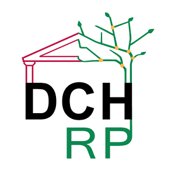
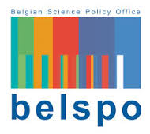
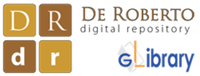
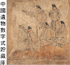
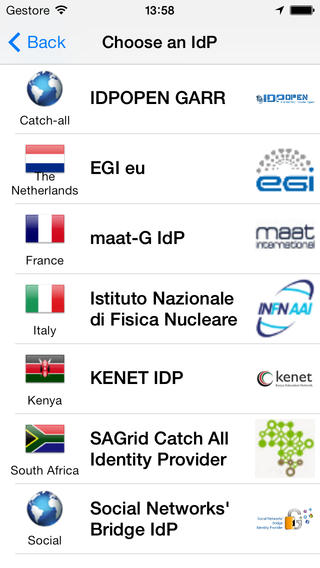
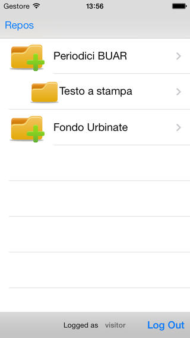
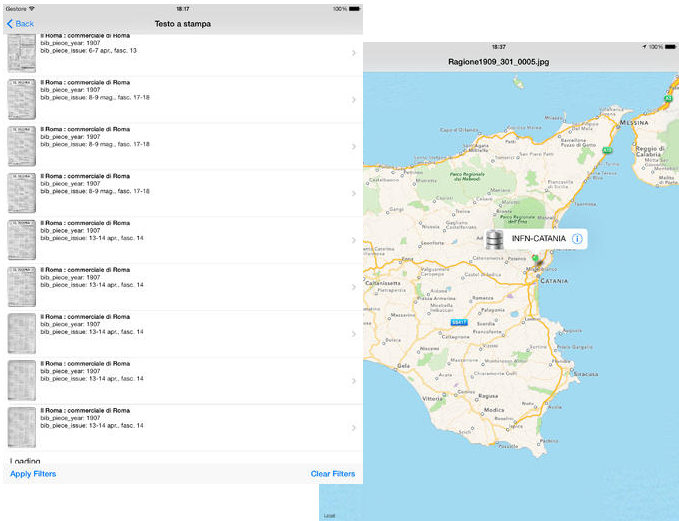

*********************************
DCH-RP eCSG Mobile (v 2.3.0) Docs
*********************************

============
About
============

.. _PROJECT-URL:    http://dch-rp.eu/
.. _SG-URL:         http://ecsg.dch-rp.eu/
.. _PLAY:           https://play.google.com/store/apps/details?id=it.infn.ct.dchrpSGmobile
.. _ITUNES:         https://itunes.apple.com/us/app/dch-rp-ecsg-mobile/id742094899?ls=1&mt=8

-------------

.. _DCH-RP: https://play.google.com/store/apps/details?id=it.infn.ct.dchrpSGmobile
.. _ECSG-DCH-RP: http://ecsg.dch-rp.eu/

**DCH-RP eCSG Mobile** is a mobile application developed in the contest of `DCH-RP project <PROJECT-URL_>`_ Android and iOS versions are available from `Google Play <PLAY_>`_ and `App Store <ITUNES_>`_. The main aim of this mobile app is to provide an easy way to access, from your mobile appliances, digital assets and its metadata stored in different kinds of storage:

- Local storage
- Grid storage
- Cloud storage

DCH-RP eCSG Mobile currently provides to the following repositories:

1. Belgian Science Policy Office (`BELSPO <https://www.belspo.be/>`_) 

2. Istituto Centrale per il Catalogo Unico (`ICCU <http://www.iccu.sbn.it/>`_) 

3. Digital Repository of Federico De Roberto works (`De Roberto DR <http://glibrary.ct.infn.it/>`_) 

4. Digital Repository of the Architectural and Archaeological Heritage in the Mediterranean Area (`De Roberto DR <http://glibrary.ct.infn.it/>`_) 

5. China Relics Data repositories(`China Relics DR <http://eunode7.jsi.buaa.edu.cn/>`_) 

   
6. Center for Documentation of Cultural and Natural Heritage (`CULTNAT Collections <http://cultnat.org/>`_) 

============
Installation
============

To install DCH-RP eCSG Mobile on your devices simply download the app from the store

|PLAY-STORE| |APP-STORE| 

.. |PLAY-STORE| image:: images/google_play_icon.png
   :align: middle 
   :target: PLAY_
   :alt: DCH-RP eCSG Mobile play store
   :scale: 100%

or scan one of the following QR code 

|ANDROID-QR| |IOS-QR|

    

============
Usage
============

To use the DCH-RP eCSG Mobile requires federated credentials issued by an Identity Provider. If the organisation you belong to has an Identity Provider, proceed with the download; otherwise, you can first get federated credentials registering to the "open" Identity Provider, which belongs to the GrIDP federation.

Once the application is installed on you mobile device, you can access the services using your federated credentials selecting the organization you belong and the Identity Provider (see Figure 1).

   
   Figure 1. Identity Provider List

If your credentials are correct, the application shows the main view from which you could access repositories. As example the Figure 2 shows the repositories available for the ICCU proof of concept.

   
   Figure 2. ICCU Repositories

Selecting the the type of asset you are interested in, the application shows a list of available digital assets (see Figure 3) from which you could select the digital object. The application provides also a hierarchical filter mechanism that allows you to easly retreive the asset and metadata you are looking for.

The Figure 3 shows also the available storages where the digital asset is available and a link to download the asset on your device.

   
   Figure 3. Asset download

============
Support
============
Please feel free to contact us any time if you have any questions or comments.

.. _INFN: http://www.ct.infn.it/
.. _DFA: http://www.dfa.unict.it/
.. _ARN: http://www.grid.arn.dz/

:Authors:

 `Mario TORRISI <mailto:mario.torrisi@ct.infn.it>`_ - University of Catania (DFA_),

 `Antonio CALANDUCCI <mailto:antonio.calanducci@ct.infn.it>`_ - Italian National Institute of Nuclear Physics (INFN_),

:Version: (v 2.3.0), 2015

:Date: June 22th, 2015 13:54
